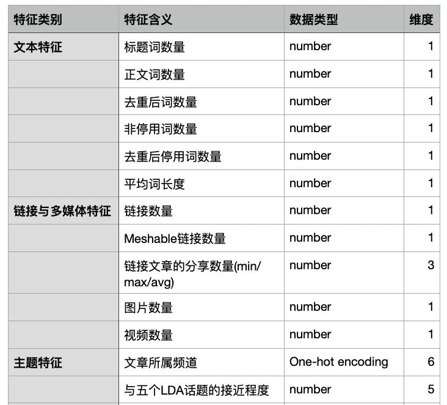
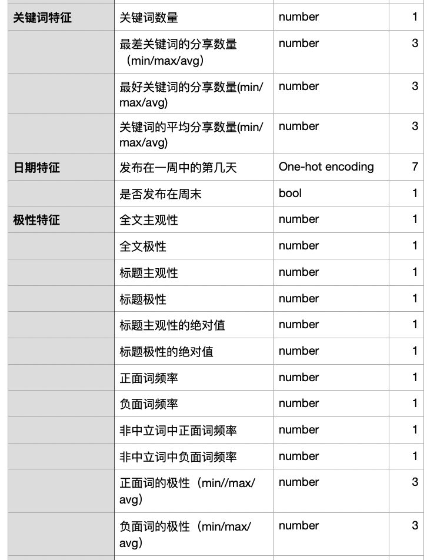
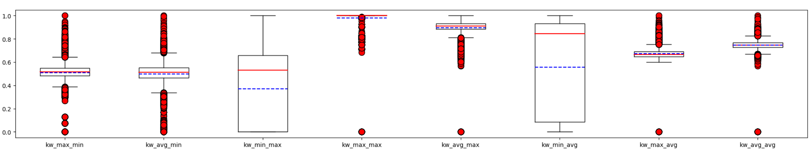
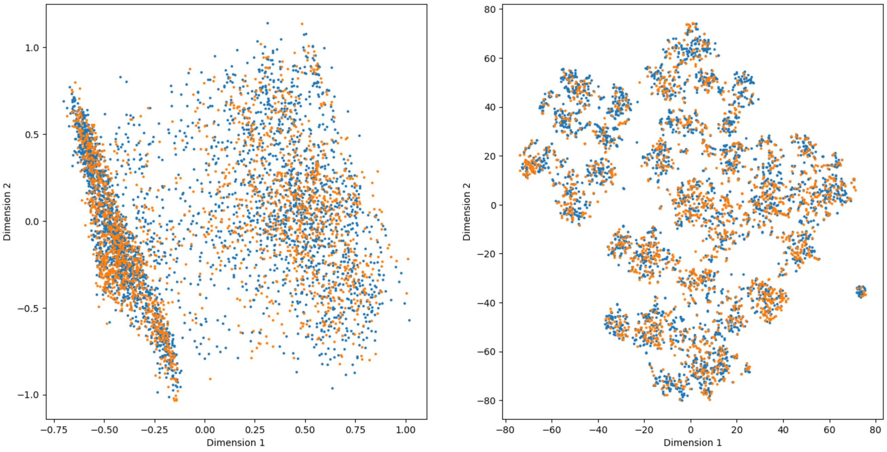
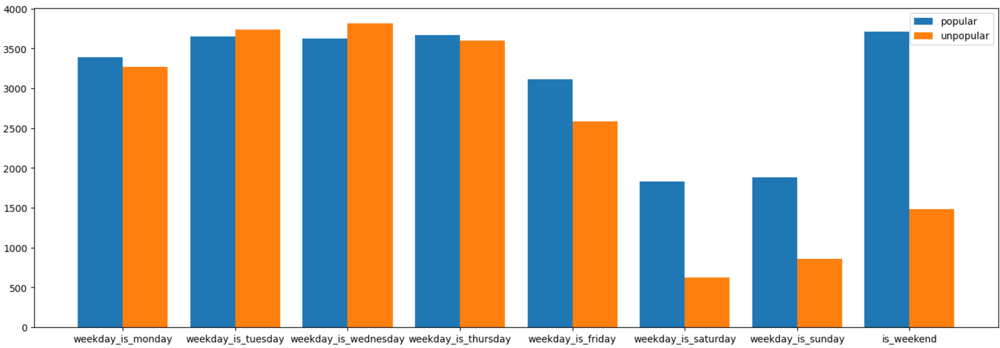
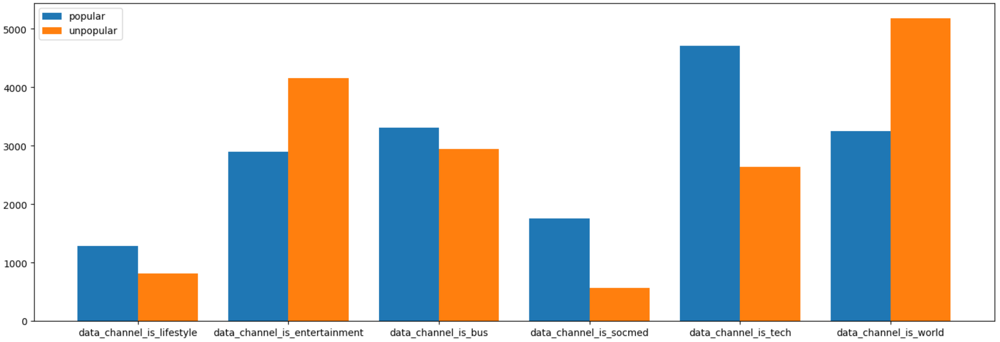
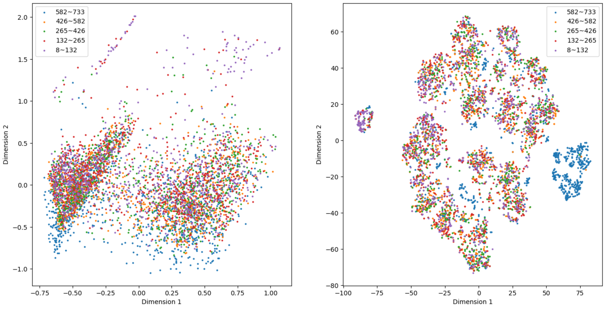

## 数据挖掘第一次大作业报告

组长：罗弈桢 2022310868

组员：侯振宇 许若虞

分工：

- 罗弈桢：数据分析、预处理与可视化，消融实验

- 侯振宇：手动实现Logistic Regression算法
- 许若虞：实现PCA-KNN、SVM、FNN、Naive Bayes算法

### 1.问题描述

本次作业要求从Online News Popularity数据集中，根据文章的特征预测该其热度。根据题意将该问题抽象为一个二分类问题，即给定输入特征$x\in \mathbb{R}^{n}$，训练模型$f:\mathbb{R}^{n}\rightarrow\{0,1\}$，对文章是否受欢迎进行预测。

我们实现了五个常见的分类模型，分别为Logistic Regression、PCA-KNN、SVM、FNN和Naive Bayes。关于模型 的实现细节和具体表现分别在第3节和第4节中进行详细介绍。

衡量模型的指标包括Accuracy、AUC和F1 score。三个指标的具体含义将在第3节中介绍。

### 2.数据分析与预处理

#### 2.1 数据分析与可视化

这部分代码在`preprocessing.ipynb`中。

阅读`OnlineNewsPopularity.names`可知该数据集包括了2013至2015年Meshable网站上发布的39797条新闻，统计了61维特征，其中前两维特征分别为新闻的url和发布时间，后58维特征表示了新闻的某些属性，最后1维特征为转发数。可以发现原始数据已经根据发布时间从前到后进行了排序。根据题意，认为shares>=1400为受欢迎，标签为1，否则标签为0。统计得原始数据共包含39644个样本，其中正样本数量为21154，负样本数量为18490。

各个特征的含义、维度和数值类型如下表所示：

对各个数字类型的特征进行归一化并绘制盒图，通过皮尔逊相关系数和卡方检验分析它们与分享次数的关系，有如下几个结论：
- 数据中存在一个离群点，绝大多数样本的`n_unique_tokens`，`n_non_stop_words`和`n_non_stop_unique_tokens`取值都在$[0,1]$之间，因此三个词条应当反映的是比率数值而不是绝对数值，而某一样本的这三个特征取值分别为701,1042,650，需要剔除，否则会影响归一化的结果；

- 部分特征的数值分布比较极端，如`kw_max_min`，该特征的最大值与平均值相差了2个数量级，且观察盒图可以发现绝大多数样本分布在中间，而少数样本分布在较大或较小的区域，这些特征可能会导致后续模型训练中数值不稳定；
  

- 新闻的关键词的分享次数与极性与分享次数具有更高的相关性。平均关键词与最差关键词的分享次数越多，新闻越偏向正面，则分享次数越多；

    | 特征名                    | 皮尔逊相关系数 |
    | ------------------------- | -------------- |
    | kw_max_min                | 0.0842         |
    | kw_avg_min                | 0.0923         |
    | kw_max_avg                | 0.1197         |
    | kw_avg_avg                | 0.1393         |
    | global_subjectivity       | 0.0681         |
    | global_sentiment_polarity | 0.1193         |
    | rate_negative_words       | -0.0712        |

- 存在一些无用特征，如`n_nonstop_words`，样本的取值分布集中在0和0.99以上，观察该特征值为0的新闻可以发现它只有图片和视频，没有文本，另一方面，该特征与分享次数的皮尔逊相关系数约为0；

进一步地，使用sklearn中实现的PCA和t-SNE方法对特征降至2维并可视化，如下图所示（左为PCA，右为t-SNE，蓝色和橙色的点分别代表正/负样本，由于t-SNE算法运行效率较低，因此只选择了5000个样本做可视化）：

可以发现不管采用哪种算法进行降维，正负样本都不是线性可分的，并且正负样本特征的聚类性质不是特别明显，因此使用单个线性分类器或KNN的方法可能无法取得非常理想的结果。

对于weekday和channel两类特征绘制柱状图，如下所示：

发现这两类特征在正样本和负样本上的分布具有符合直觉的规律，如周末发布的新闻和与社交媒体、技术等主题相关的新闻更受欢迎，而关于娱乐和世界主题的新闻则不受欢迎。

#### 2.2 数据预处理

数据预处理代码在`preprocessing.py`中，主要包括了以下几个部分：

- 离群点剔除；
- 特征归一化，首先对取值范围比较大的特征取对数，接着使用MinMax进行归一化，即对于第i维特征，$x_{j,i}=\frac{x_{j,i}-\min_k{x_{k,i}}}{\max_k{x_{k,i}}-\min_{k}x_{k,i}}$；
- 数据集分割，实现了两种分割策略，分别为按照时间顺序和随机对数据集进行train:test=4:1的分割；

### 3.模型与实验设置

#### 3.1 实现模型简介

- Logistic Regression

- PCA-KNN

- SVM

- FNN

- Naive Bayes

#### 3.2 评价指标简介

TODO：介绍一下所用的指标

#### 3.3 超参设置

TODO：说明超参的搜索范围和最佳超参

### 4.实验结果与分析

#### 4.1 Benchmark结果

| Model               | Accuracy | AUC  | F1 Score |
| ------------------- | -------- | ---- | -------- |
| Logistic Regression |          |      |          |
| PCA-KNN             |          |      |          |
| SVM                 |          |      |          |
| FNN                 |          |      |          |
| Naive Bayes         |          |      |          |

TODO：调参，报告最佳结果，绘制并分析AUC曲线

####  4.2 消融实验

为了验证第二节中提到的高相关性特征和无用特征，设计了如下实验：

仅考虑训练集，首先将所有特征按照与标签的皮尔逊相关系数从高到低排序，使用前$k$个或后$k$个特征作为输入，比较五个模型的AUC结果。

#### 4.2 场景1分析

TODO：可解释性分析

####  4.3 场景2分析

首先对发布时间与特征的关系进行研究，按照各个样本的`time_delta`值分为5类，从每一类中随机选取1000个样本，用PCA和t-SNE方法将特征降维并可视化如下：

可以发现发布时间与特征存在一定关联，如发布时间较早的新闻（`time_delta`在$[582,732]$之间）的PCA降维结果偏向于分布在下半平面，而t-SNE的降维结果则呈现出比较明显的聚类特征。

TODO：

完成不同ratio的train-test的实验

完成时序数据的分析

